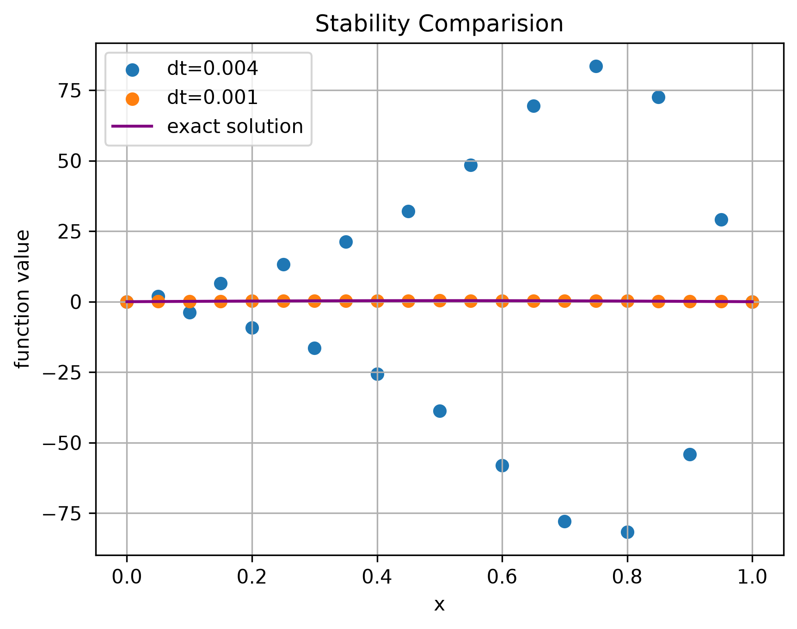
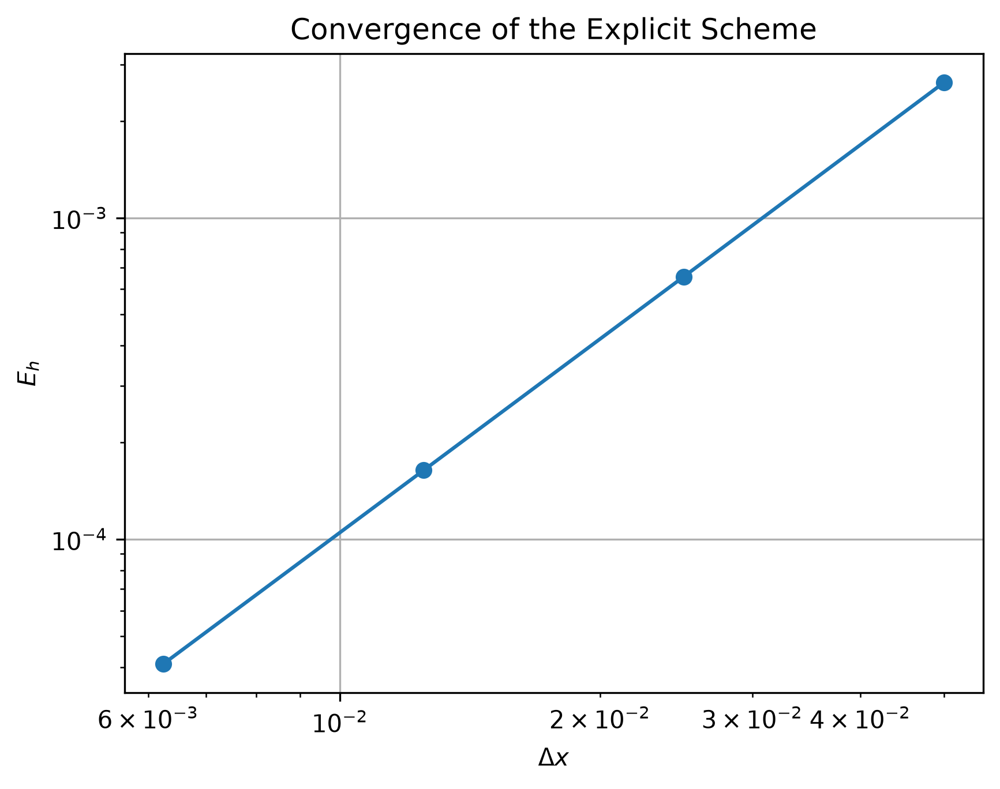

# Heat Equation Numerical Analysis

This project implements a finite-difference solver for the one-dimensional
heat equation and studies its consistency, stability, and convergence.

## PDE Model

We consider

$$
\begin{cases}
u_t=u_{xx}, \quad x\in(0,1), \ t>0,\\
u(t,0)=u(t,1)=0,\\
u(0,x)=\sin(\pi x).
\end{cases}
$$

The exact solution is

$$
u(t,x)=e^{-\pi^2t}\sin(\pi x).
$$

## Numerical Method

The equation is discretized using:

- Forward Euler in time
- Centered finite differences in space

The resulting scheme is

$$
u_j^{n+1}
=
u_j^n+
r(u_{j+1}^n-2u_j^n+u_{j-1}^n),
$$

where

$$
r=\frac{\Delta t}{(\Delta x)^2}.
$$

## Consistency

The local truncation error satisfies

$$
\tau_j^n
=
O(\Delta t)+O(\Delta x^2),
$$

so the scheme is first-order accurate in time and second-order accurate
in space.

## Stability

For the explicit scheme, the stability condition is

$$
r\leq\frac12.
$$

Stable and unstable choices of the time step are compared numerically. 

  

## Convergence

The maximum error is defined by

$$
E_h=
\max_j
|u_j^N-u(T,x_j)|.
$$

The observed convergence order is computed using

$$
p=
\frac{\log(E_h/E_{h/2})}{\log 2}.
$$

With

$$
\Delta t=0.4(\Delta x)^2,
$$

the observed convergence rate is approximately second order.

  

## Files

- `heat_equation.ipynb`: numerical implementation and experiments
- `figures/`: generated figures

## Main Results

The experiments demonstrate:

- consistency of the finite-difference discretization;
- stability when $r\leq1/2$;
- numerical instability when the stability condition is violated;
- approximately second-order convergence under
  $\Delta t=O(\Delta x^2)$.